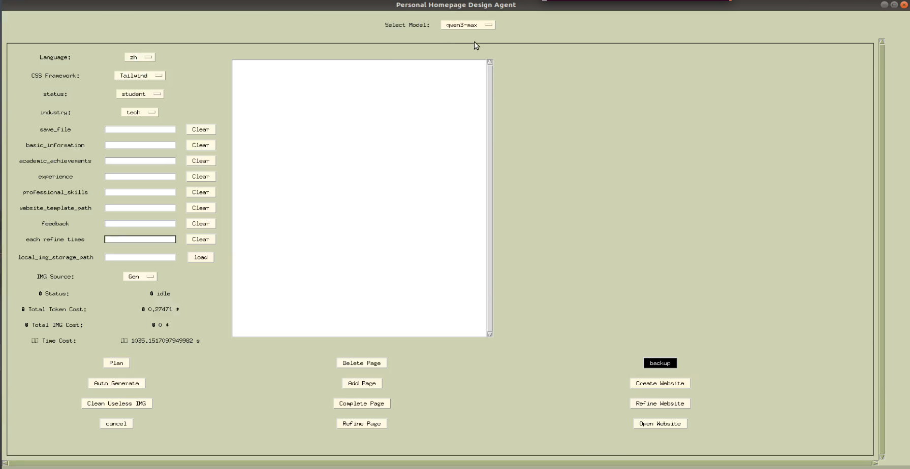

# ResumeAgent

> 🤖 An autonomous agent for generating elegant personal resume websites using large language models (LLMs).

---

## 🌟 Overview

**ResumeAgent** is a lightweight and extendable framework, focusing on generating **personal homepage / resume websites** through LLM-driven planning and web code generation.
ResumeAgent focuses on simplicity and usability — after running the setup, anyone can easily build a personalized website via a simple GUI panel, without requiring design or coding experience.
It supports both text-based descriptions and optional image templates for layout inspiration.

### 🎥 Demo Video

You can view a demo video here:  

[demo.webm](https://github.com/user-attachments/assets/df4a030a-6321-4b35-a20a-1e9a7c4d8550)
---

## 🔑 Key Features

🧩 Resume Website Generation – Automatically design personal websites (About, Projects, Publications, Contact, etc.) based on your CV or written description.

✨ Simple GUI Workflow – Once set up, anyone can build their own website with just a few clicks in the GUI panel.

🖼️ Optional Image Templates – Load local images or layout templates to guide visual structure.

🛠️ Editable & Extendable – You can manually refine generated HTML/CSS or let the agent iteratively improve the results.

🔗 Multi-Page Output – Automatically generate connected pages with consistent layout and internal links.

🤖 Qwen & OpenAI Compatible – Supports both Alibaba DashScope and OpenAI APIs.

---

## 🛠️ Requirements and Installation

```bash
git clone https://github.com/bj-Liu/resumeagent.git
cd resumeagent
pip install -r requirements.txt
```

## ⚙️ Configuration Example (config.yaml)

```bash
# Browser type for visualization (choose one)
web_type: "firefox"         # Options: "chrome", "firefox", "edge"

# LLM backend selection
LLM_TYPE: "qwen"            # Options: "openai", "qwen"

# --- OpenAI / Azure configuration ---
is_azure: false             # Set true if using Azure OpenAI API

# Azure settings (only needed if is_azure: true)
AZURE_OPENAI_ENDPOINT: ""
AZURE_OPENAI_KEY: ""
AZURE_OPENAI_API_VERSION: ""

# OpenAI settings (for direct OpenAI API usage)
OPENAI_API_KEY: ""
OPENAI_PROXY_URL: ""
OPENAI_BASE_URL: ""

# --- Qwen configuration (for DashScope) ---
DASHSCOPE_API_KEY: ""
```

## 🚀 Quick Start

GUI Mode

python gui.py
Then you will enter the GUI as follows: 


Choose Web Design Mode

Select Model (e.g. qwen3-7b, gpt-4o, etc.)
Set your language and CSS framework
Fill in your personal profile, e.g. "Zhang San, M.S. in Computer Science, Tsinghua University. Research focus: Multimodal LLMs, Embodied AI, Explainable Vision. Academic email: zhangsan@tsinghua.edu.cn"
Click Plan → Auto Generate

Generated HTML files and screenshots will be saved in your configured save_file path.


## 🙏 Acknowledgements

This project is inspired by [WebDesignAgent](https://github.com/DAMO-NLP-SG/WebDesignAgent),
ResumeAgent reuses and modifies certain components under the terms of that license.

© 2025 bj-Liu
Licensed under the MIT License.